# Authentication Architecture

## System Overview

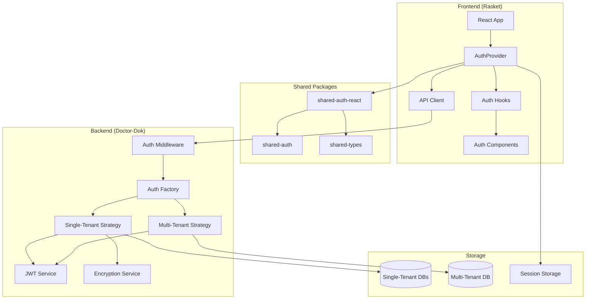

## Component Relationships

### 1. Frontend Layer

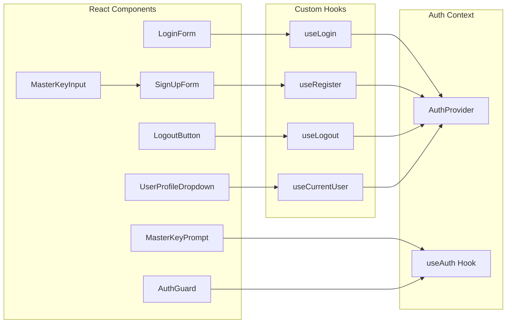

### 2. Backend Layer

```mermaid
graph TB
    subgraph "API Routes"
        A[/api/auth/login]
        B[/api/auth/register]
        C[/api/auth/refresh]
        D[/api/auth/logout]
    end
    
    subgraph "Auth Factory"
        E[AuthModeFactory]
        F[AuthConfig]
    end
    
    subgraph "Strategies"
        G[BaseAuthStrategy]
        H[SingleTenantStrategy]
        I[MultiTenantStrategy]
    end
    
    subgraph "Services"
        J[JWTService]
        K[EncryptionUtils]
        L[Database Service]
    end
    
    A --> E
    B --> E
    C --> E
    D --> E
    
    E --> F
    E --> G
    G --> H
    G --> I
    
    H --> J
    H --> K
    H --> L
    I --> J
    I --> L
```

## Data Flow

### Registration Flow - Single Tenant

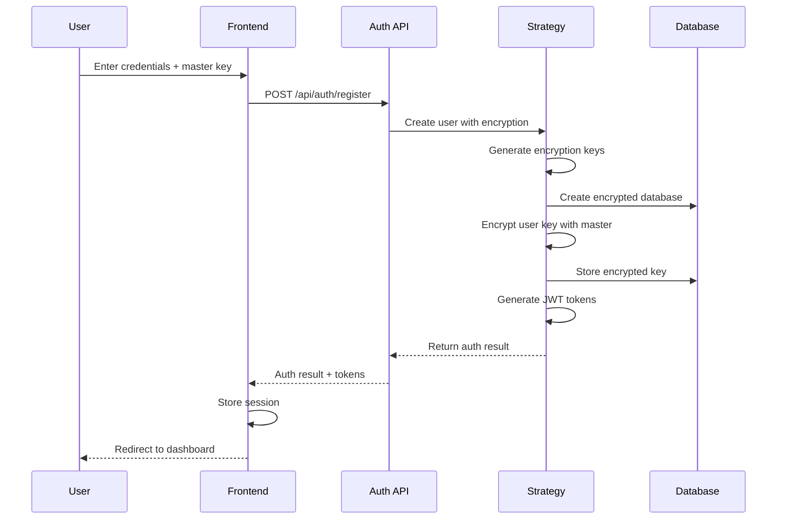

### Login Flow - Multi Tenant

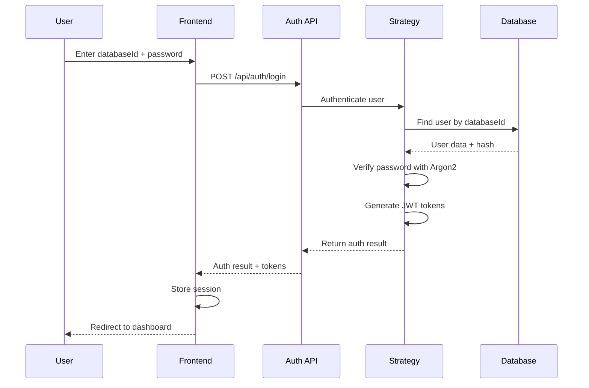

### Token Refresh Flow

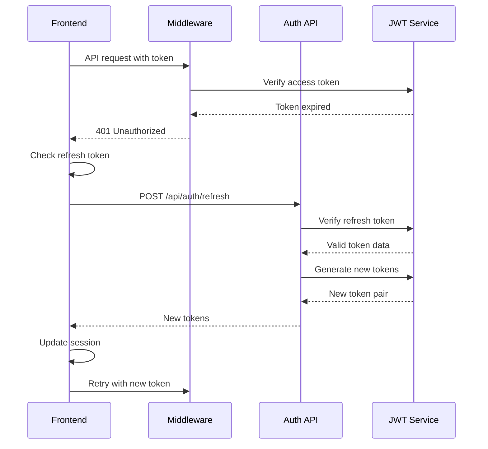

## Security Architecture

### 1. Encryption Layers

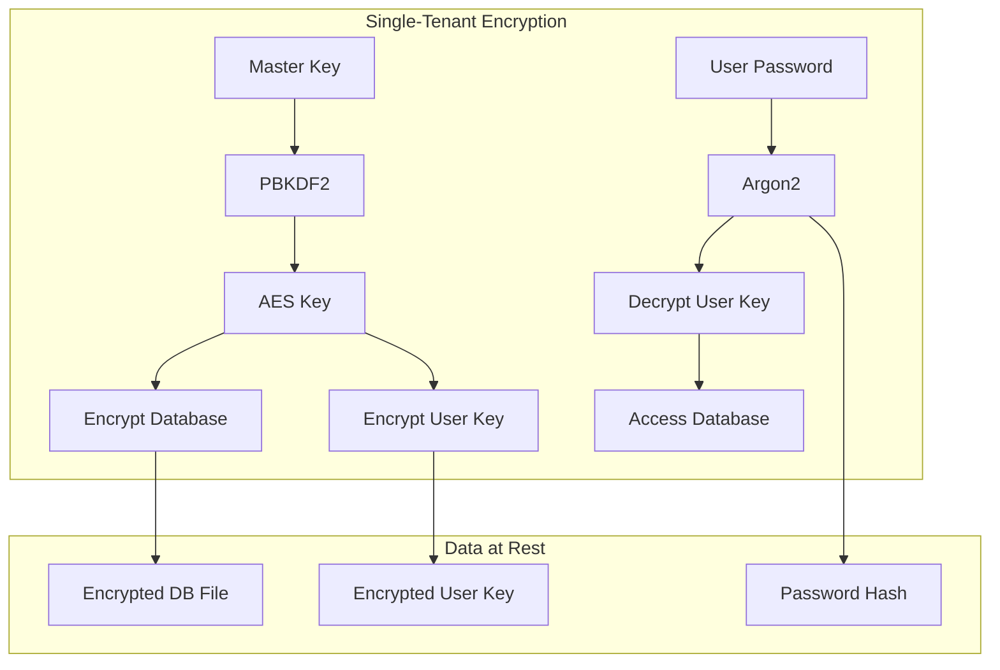

### 2. Token Security

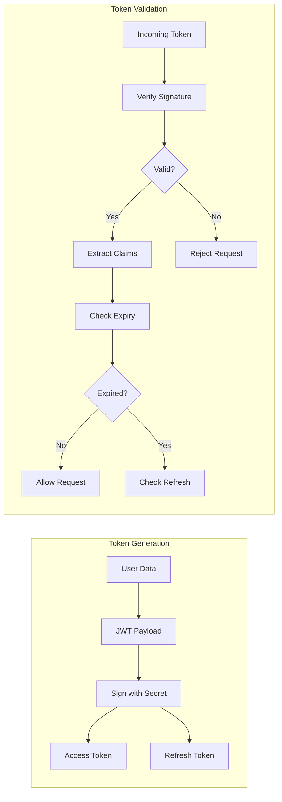

## Storage Architecture

### 1. Database Structure

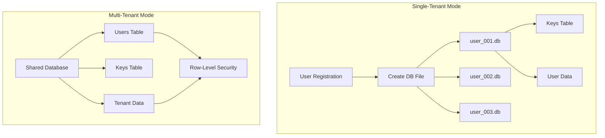

### 2. Session Storage

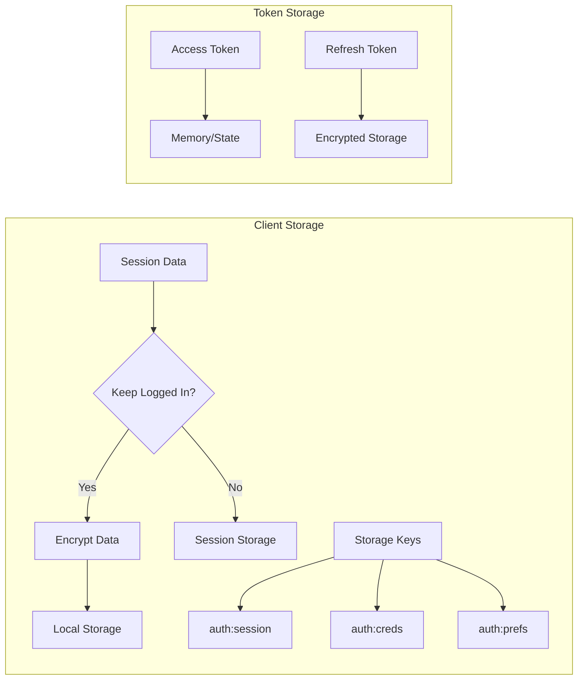

## Error Handling Architecture

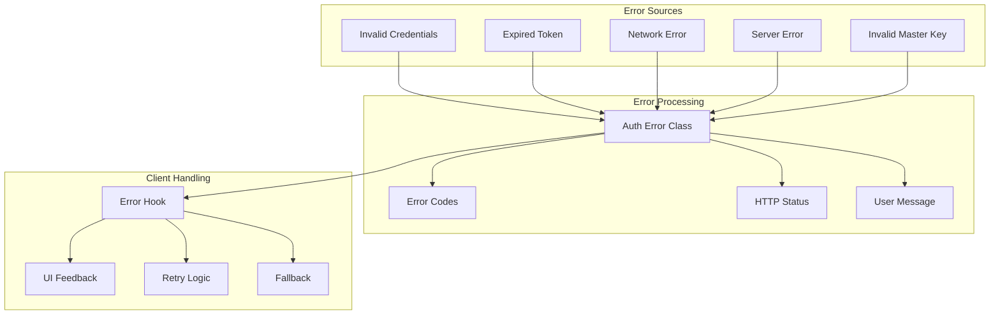

## Deployment Considerations

### 1. Environment-Based Configuration

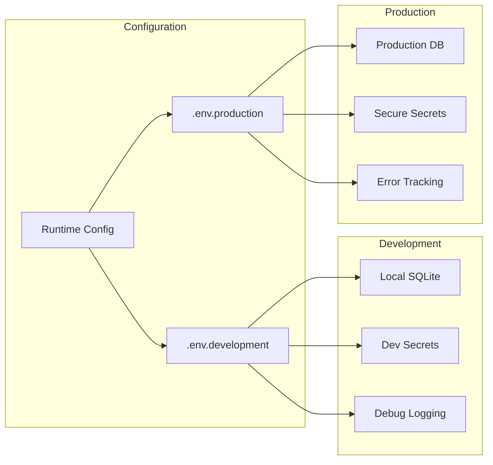

### 2. Scaling Architecture

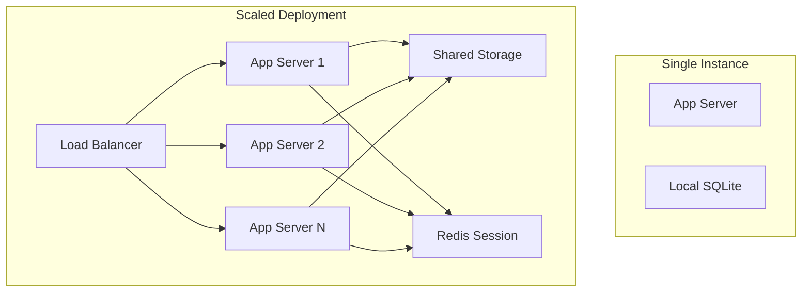

## Integration Points

### 1. Frontend Integration

- **AuthProvider**: Wraps entire app with auth context
- **API Client**: Handles token management automatically
- **Route Guards**: Protect pages requiring authentication
- **UI Components**: Pre-built auth forms and controls

### 2. Backend Integration

- **Middleware**: Protects API routes automatically
- **User Context**: Available in all protected routes
- **Database Access**: Mode-specific data isolation
- **Audit Logging**: Track all auth events

### 3. External Services

Future integration points:
- OAuth providers (Google, GitHub, etc.)
- SAML for enterprise SSO
- LDAP/Active Directory
- Multi-factor authentication services

## Performance Considerations

1. **Token Caching**: Minimize JWT verification overhead
2. **Database Pooling**: Reuse connections in multi-tenant
3. **Encryption Caching**: Cache derived keys appropriately
4. **Session Storage**: Use efficient serialization
5. **API Batching**: Reduce auth-related API calls