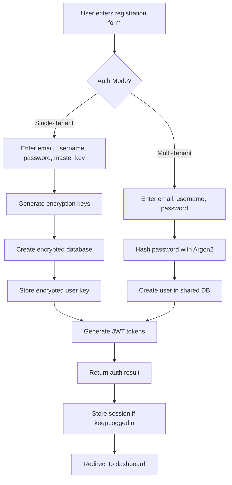
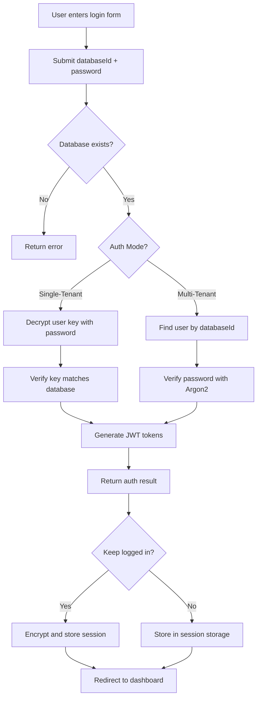
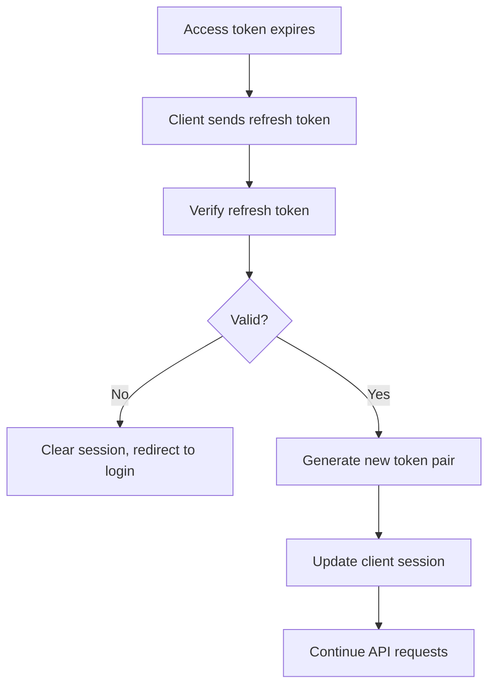

# Authentication Flow Documentation

## Overview

The Combined Template authentication system supports two distinct modes:
- **Single-Tenant Mode**: Each user gets their own encrypted SQLite database
- **Multi-Tenant Mode**: Multiple users share a database with row-level security

This document describes the authentication flows for both modes.

## Architecture Components

### 1. Shared Authentication Packages

#### `@doctor-dok/shared-auth`
Core authentication services:
- `JWTService`: Token generation and verification
- `EncryptionUtils`: AES-GCM encryption for sensitive data
- `BaseAuthService`: Abstract class for auth operations
- `AuthMiddleware`: Next.js middleware for protected routes

#### `@doctor-dok/shared-auth-react`
React-specific authentication:
- `AuthContext`: Global auth state management
- `AuthGuard`: Component for protecting routes
- Custom hooks: `useLogin`, `useRegister`, `useLogout`, etc.
- `AuthApiClient`: API communication layer

### 2. Authentication Mode Implementation

Located in `apps/doctor-dok/src/auth/`:
- `auth-mode.factory.ts`: Factory pattern for mode selection
- `auth.config.ts`: Environment-based configuration
- `strategies/single-tenant-auth.strategy.ts`: Single-tenant implementation
- `strategies/multi-tenant-auth.strategy.ts`: Multi-tenant implementation

## Authentication Flows

### Registration Flow



### Login Flow



### Token Refresh Flow



## Security Features

### 1. Password Security
- **Hashing**: Argon2id with secure parameters
- **Salting**: Unique salt per password
- **Parameters**: 
  ```typescript
  {
    memory: 19456,
    iterations: 2,
    parallelism: 1,
    hashLength: 32
  }
  ```

### 2. Token Security
- **Access Token**: 15-minute expiration
- **Refresh Token**: 8-hour expiration
- **Algorithm**: HS256 with strong secrets
- **Auto-refresh**: 5 minutes before expiration

### 3. Encryption (Single-Tenant)
- **Algorithm**: AES-GCM
- **Key Derivation**: PBKDF2 with 100,000 iterations
- **Master Key**: User-provided, never stored
- **Database Encryption**: Full database file encryption

### 4. Session Storage
- **Temporary**: sessionStorage for normal sessions
- **Persistent**: localStorage with encryption for "keep logged in"
- **Encryption Key**: Derived from user credentials

## API Endpoints

### Authentication Endpoints

| Endpoint | Method | Description | Request Body | Response |
|----------|--------|-------------|--------------|----------|
| `/api/auth/login` | POST | User login | `LoginDto` | `AuthResult` |
| `/api/auth/register` | POST | User registration | `CreateUserDto` | `AuthResult` |
| `/api/auth/refresh` | POST | Refresh tokens | `RefreshTokenDto` | `TokenPair` |
| `/api/auth/logout` | POST | User logout | `{ userId }` | `void` |

### Database Endpoints (Doctor-Dok specific)

| Endpoint | Method | Description | Request Body | Response |
|----------|--------|-------------|--------------|----------|
| `/api/db/create` | POST | Create encrypted DB | Complex | `AuthResult` |
| `/api/db/authorize` | POST | Authorize DB access | Complex | `AuthResult` |
| `/api/db/challenge` | POST | Get auth challenge | `{ databaseId }` | `{ challenge }` |

## Data Types

### LoginDto
```typescript
{
  databaseId: string;
  password: string;
  keepLoggedIn?: boolean;
}
```

### CreateUserDto
```typescript
{
  email?: string;
  username?: string;
  password: string;
  masterKey?: string; // Required for single-tenant
}
```

### AuthResult
```typescript
{
  user: {
    id: string;
    email?: string;
    username?: string;
    databaseId: string;
    keyId: string;
    role?: string;
    createdAt: Date;
    updatedAt: Date;
  };
  tokens: {
    accessToken: string;
    refreshToken: string;
    expiresIn: number;
  };
}
```

## Frontend Integration

### 1. Provider Setup
```tsx
// App.tsx
import { RasketAuthProvider } from '@/providers/AuthProvider';

<RasketAuthProvider>
  <Routes />
</RasketAuthProvider>
```

### 2. Using Auth Hooks
```tsx
// Login Component
import { useLogin } from '@doctor-dok/shared-auth-react';

const { login, isLoading, error } = useLogin();
await login({ databaseId, password, keepLoggedIn });
```

### 3. Protected Routes
```tsx
import { AuthGuard } from '@doctor-dok/shared-auth-react';

<AuthGuard redirectTo="/auth/sign-in">
  <ProtectedComponent />
</AuthGuard>
```

### 4. User Information
```tsx
import { useCurrentUser } from '@doctor-dok/shared-auth-react';

const { user, isLoading } = useCurrentUser();
```

## Error Handling

### Error Codes
```typescript
enum AuthErrorCode {
  INVALID_CREDENTIALS = 'INVALID_CREDENTIALS',
  TOKEN_EXPIRED = 'TOKEN_EXPIRED',
  TOKEN_INVALID = 'TOKEN_INVALID',
  REFRESH_TOKEN_INVALID = 'REFRESH_TOKEN_INVALID',
  USER_NOT_FOUND = 'USER_NOT_FOUND',
  DATABASE_NOT_FOUND = 'DATABASE_NOT_FOUND',
  MASTER_KEY_REQUIRED = 'MASTER_KEY_REQUIRED',
  MASTER_KEY_INVALID = 'MASTER_KEY_INVALID',
  PERMISSION_DENIED = 'PERMISSION_DENIED',
  SESSION_EXPIRED = 'SESSION_EXPIRED',
  CONFIGURATION_ERROR = 'CONFIGURATION_ERROR',
}
```

### Error Responses
All auth errors return:
```json
{
  "error": "Error message",
  "code": "ERROR_CODE",
  "statusCode": 401
}
```

## Best Practices

### 1. Security
- Always use HTTPS in production
- Store JWT secrets securely
- Rotate refresh tokens on use
- Implement rate limiting
- Log authentication events

### 2. Master Key Management
- Generate strong master keys (24+ characters)
- Never store master keys on servers
- Provide clear backup instructions
- Implement key rotation strategy

### 3. Session Management
- Clear sessions on logout
- Implement idle timeout
- Handle token refresh gracefully
- Store minimal data in tokens

### 4. Development
- Use different secrets for dev/prod
- Test both auth modes thoroughly
- Monitor authentication metrics
- Implement proper logging

## Configuration

### Environment Variables

```env
# Authentication Mode
AUTH_MODE=single-tenant # or multi-tenant

# JWT Configuration
JWT_ACCESS_SECRET=your-access-secret
JWT_REFRESH_SECRET=your-refresh-secret
JWT_ACCESS_EXPIRY=15m
JWT_REFRESH_EXPIRY=8h

# Database
DATABASE_URL=./data/app.db
ENCRYPTION_ENABLED=true # single-tenant only

# Frontend
VITE_API_URL=http://localhost:3000
VITE_AUTH_MODE=single-tenant
```

## Testing Authentication

### Manual Testing Checklist
- [ ] Register new user (both modes)
- [ ] Login with valid credentials
- [ ] Login with invalid credentials
- [ ] Token refresh flow
- [ ] Logout functionality
- [ ] Master key validation (single-tenant)
- [ ] Session persistence
- [ ] Protected route access
- [ ] Error handling

### Automated Testing
See test files in:
- `packages/shared-auth/src/__tests__/`
- `packages/shared-auth-react/src/__tests__/`
- `apps/doctor-dok/src/auth/__tests__/`

## Troubleshooting

### Common Issues

1. **"Invalid credentials" on login**
   - Verify databaseId is correct
   - Check password spelling
   - Ensure database was created

2. **"Master key required" error**
   - Only for single-tenant mode
   - Must provide master key on registration
   - Cannot be empty or weak

3. **"Token expired" errors**
   - Check token expiration settings
   - Verify refresh logic is working
   - Ensure system clocks are synchronized

4. **Session not persisting**
   - Check "Keep logged in" option
   - Verify localStorage is enabled
   - Check for cookie/storage restrictions

## Migration Guide

For migrating from other auth systems, see:
- [Rasket Migration Guide](../../../apps/rasket/docs/AUTH_MIGRATION.md)
- [Doctor-Dok Integration Guide](../integration-strategy.md)

## Future Enhancements

Planned improvements:
1. OAuth/SSO integration
2. Two-factor authentication
3. Biometric authentication
4. Password reset flow
5. Account recovery options
6. Rate limiting and brute force protection
7. Audit logging enhancements