# Component Dependency Analysis

This document maps out the dependencies between Doctor-Dok components to determine the optimal migration order.

## Dependency Graph

```mermaid
graph TD
    %% UI Foundation Layer
    button[ui/button.tsx]
    input[ui/input.tsx]
    label[ui/label.tsx]
    checkbox[ui/checkbox.tsx]
    select[ui/select.tsx]
    textarea[ui/textarea.tsx]
    card[ui/card.tsx]
    alert[ui/alert.tsx]
    dialog[ui/dialog.tsx]
    popover[ui/popover.tsx]
    tabs[ui/tabs.tsx]
    
    %% Authentication Components
    authGuard[authorization-guard.tsx]
    authForm[authorize-database-form.tsx]
    authPopup[authorize-popup.tsx]
    createDb[create-database-form.tsx]
    changeKey[change-key-form.tsx]
    
    %% Layout Components
    topHeader[top-header.tsx]
    topHeaderStatic[top-header-static.tsx]
    themeProvider[theme-provider.tsx]
    
    %% Data Display Components
    recordItem[record-item.tsx]
    recordList[record-list.tsx]
    recordForm[record-form.tsx]
    folderItem[folder-item.tsx]
    auditLog[audit-log.tsx]
    
    %% Interactive Components
    chat[chat.tsx]
    chatMessage[chat-message.tsx]
    fileUpload[encrypted-attachment-uploader.tsx]
    
    %% Dependencies
    authForm --> button
    authForm --> input
    authForm --> checkbox
    authForm --> label
    authForm --> authGuard
    
    authPopup --> dialog
    authPopup --> authForm
    
    createDb --> button
    createDb --> input
    createDb --> label
    createDb --> select
    
    topHeader --> button
    topHeader --> popover
    topHeader --> themeProvider
    
    recordItem --> card
    recordItem --> button
    recordItem --> chatMessage
    
    recordList --> recordItem
    recordForm --> input
    recordForm --> textarea
    recordForm --> button
    recordForm --> select
    
    chat --> chatMessage
    chat --> button
    chat --> textarea
    
    fileUpload --> button
    fileUpload --> input
```



## Migration Phases by Dependency Level

### Level 0: Foundation (No Dependencies)
These components have no dependencies and must be migrated first:

1. **UI Primitives**
   - `ui/button.tsx`
   - `ui/input.tsx`
   - `ui/label.tsx`
   - `ui/checkbox.tsx`
   - `ui/textarea.tsx`
   - `ui/select.tsx`
   - `ui/password-input.tsx`

2. **UI Containers**
   - `ui/card.tsx`
   - `ui/alert.tsx`
   - `ui/tabs.tsx`
   - `ui/accordion.tsx`
   - `ui/table.tsx`

3. **UI Overlays**
   - `ui/dialog.tsx`
   - `ui/popover.tsx`
   - `ui/sheet.tsx`
   - `ui/drawer.tsx`
   - `ui/alert-dialog.tsx`

4. **Base Components**
   - `theme-provider.tsx`
   - `authorization-guard.tsx`
   - `icons.tsx`

### Level 1: Simple Compositions
Components that depend only on Level 0:

1. **Simple Forms**
   - `change-key-popup.tsx` (depends on: dialog)
   - `folder-item.tsx` (depends on: card)
   - `audit-log-item.tsx` (depends on: card)
   - `shared/database-link-alert.tsx` (depends on: alert)
   - `shared/no-records-alert.tsx` (depends on: alert)

2. **Basic Displays**
   - `top-header-static.tsx` (depends on: basic UI)
   - `key-print.tsx` (depends on: button)
   - `template-string-renderer.tsx` (standalone utility)

### Level 2: Complex Forms
Components with multiple Level 0/1 dependencies:

1. **Authentication Forms**
   - `authorize-database-form.tsx` (depends on: button, input, checkbox, label, password-input)
   - `change-key-form.tsx` (depends on: button, input, label, password-input)
   - `create-database-form.tsx` (depends on: button, input, label, select, checkbox)

2. **Data Forms**
   - `folder-edit-popup.tsx` (depends on: dialog, input, button)
   - `shared-key-edit-popup.tsx` (depends on: dialog, input, button)

### Level 3: Complex Features
Components that depend on Level 2 components:

1. **Authentication Flow**
   - `authorize-popup.tsx` (depends on: dialog, authorize-database-form)

2. **Navigation**
   - `top-header.tsx` (depends on: button, popover, theme-provider, multiple UI)

3. **Data Management**
   - `record-form.tsx` (depends on: multiple form inputs, button)
   - `audit-log.tsx` (depends on: table, audit-log-item)
   - `folder-list-popup.tsx` (depends on: dialog, folder-item)

### Level 4: Complex Interactions
Highest level components with extensive dependencies:

1. **Record Display**
   - `record-item.tsx` (depends on: card, button, chat-message, record-item-extra)
   - `record-list.tsx` (depends on: record-item)
   - `records-wrapper.tsx` (depends on: record-list, filters)

2. **Interactive Features**
   - `chat.tsx` (depends on: chat-message, button, textarea, voice-recorder)
   - `encrypted-attachment-uploader.tsx` (depends on: button, input, progress)
   - `settings-popup.tsx` (depends on: dialog, forms, tabs)
   - `stats-popup.tsx` (depends on: dialog, charts)

## Critical Migration Paths

### Path 1: Authentication Flow (Priority: HIGH)
```
1. ui/button → ui/input → ui/checkbox → ui/label
2. authorization-guard
3. authorize-database-form
4. authorize-popup
```

### Path 2: Main Navigation (Priority: HIGH)
```
1. ui/button → ui/popover
2. theme-provider
3. top-header
```

### Path 3: Data Display (Priority: MEDIUM)
```
1. ui/card → ui/button
2. record-item (simplified version)
3. record-list
4. record-form
```

### Path 4: Modals & Popups (Priority: MEDIUM)
```
1. ui/dialog
2. All popup components
```

## Parallel Migration Opportunities

These groups can be migrated in parallel as they don't depend on each other:

**Group A: Form Inputs**
- ui/input
- ui/textarea
- ui/select
- ui/checkbox
- ui/label

**Group B: Display Components**
- ui/card
- ui/alert
- ui/table
- ui/tabs

**Group C: Overlays**
- ui/dialog
- ui/popover
- ui/sheet

## Migration Order Recommendation

### Week 1-2: Foundation
1. **Day 1-3**: All UI primitives (Group A + Group B)
2. **Day 4-5**: Overlays (Group C)
3. **Day 6-7**: Base components (auth-guard, theme-provider)
4. **Day 8-10**: Simple forms and compositions

### Week 3-4: Core Features
1. **Day 11-13**: Authentication forms
2. **Day 14-16**: Navigation (top-header)
3. **Day 17-20**: Data display components

### Week 5-6: Advanced Features
1. **Day 21-25**: Complex interactions (chat, file upload)
2. **Day 26-30**: Polish and optimization

## Risk Analysis

### High Risk Dependencies
1. **top-header.tsx** - Central to app layout
2. **record-item.tsx** - Complex with many features
3. **chat.tsx** - Real-time functionality

### Circular Dependencies
None detected in the current architecture.

### External Dependencies
- react-hook-form (compatible with both systems)
- lucide-react (compatible with both systems)
- API clients (no UI dependencies)

## Testing Strategy by Dependency Level

### Level 0 Testing
- Unit tests for each component
- Storybook stories for visual testing
- No integration tests needed

### Level 1-2 Testing
- Unit tests
- Integration tests with dependencies
- Form submission tests

### Level 3-4 Testing
- Full integration tests
- E2E tests for critical paths
- Performance benchmarks

## Conclusion

The dependency analysis reveals:
1. 21 foundation components must be migrated first
2. Authentication and navigation are critical paths
3. Many components can be migrated in parallel
4. No circular dependencies exist
5. External dependencies are compatible

Following this dependency-based migration order will minimize blockers and allow for efficient parallel work.