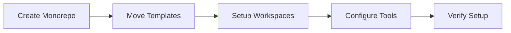
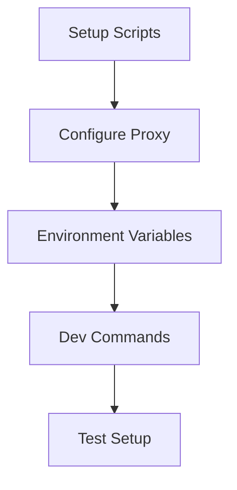
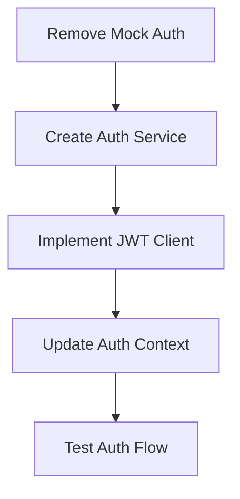
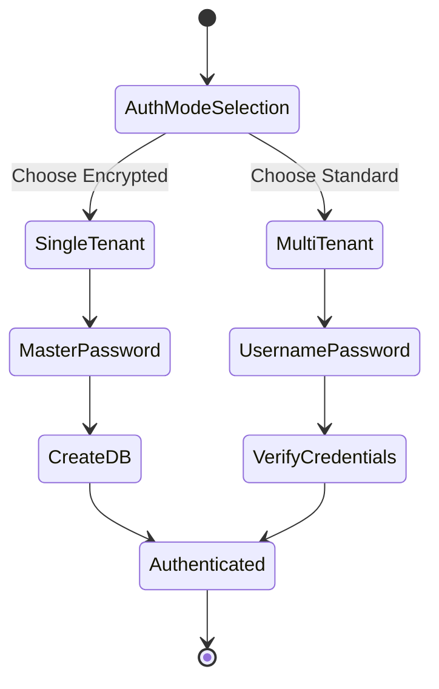
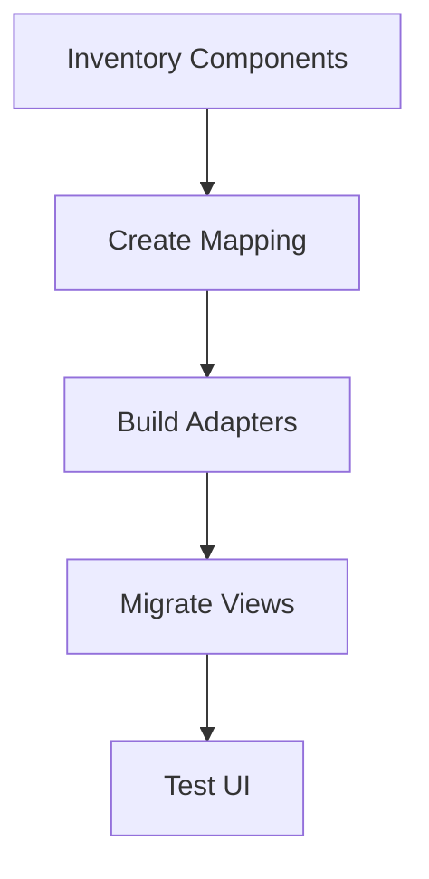
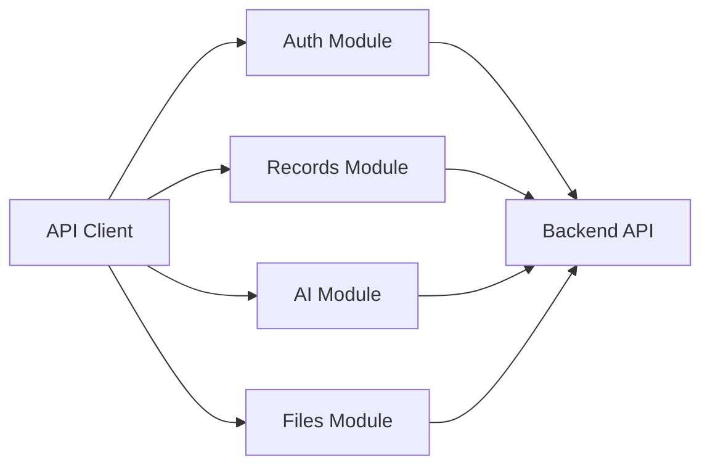
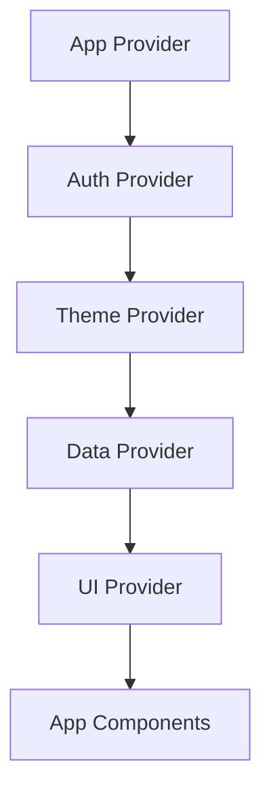
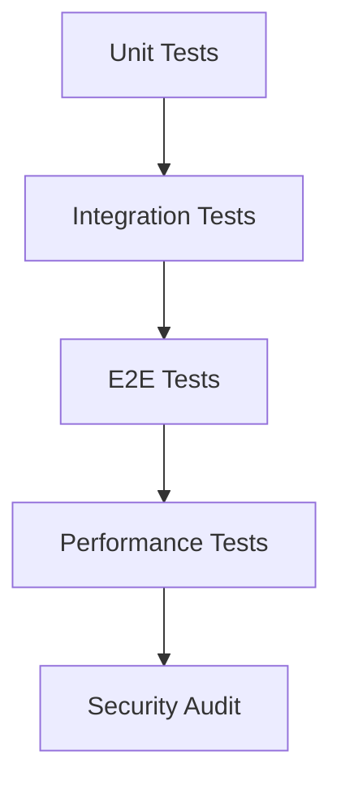
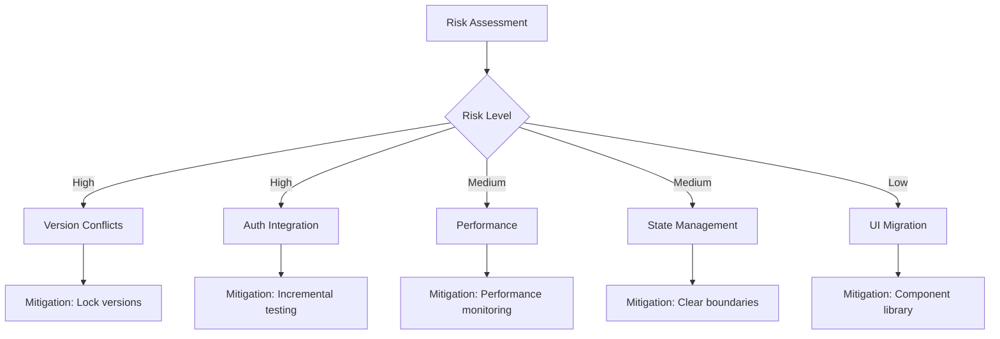
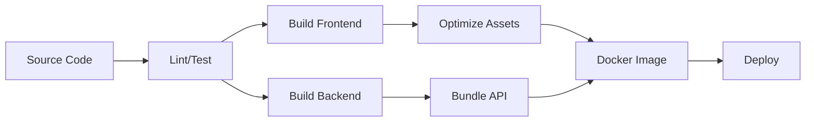

# Integration Strategy - Step-by-Step Implementation Guide

## Executive Summary

This document provides a comprehensive strategy for integrating the Rasket frontend template with the Doctor-Dok backend template. The integration follows a phased approach designed to minimize risk while ensuring a smooth transition to a unified system that maintains all existing functionality from both templates.

## Integration Overview

### Key Integration Challenges

1. **Technology Stack Differences**
   - Rasket uses Vite; Doctor-Dok uses Next.js
   - Different UI component libraries (Bootstrap vs shadcn/ui)
   - Different state management approaches

2. **Authentication Systems**
   - Rasket has mock authentication
   - Doctor-Dok has JWT-based auth with encryption

3. **Data Layer Integration**
   - Connecting React frontend to Next.js API routes
   - Maintaining encryption and security features
   - Supporting both single and multi-tenant modes

4. **Development Workflow**
   - Combining two separate development processes
   - Unifying build and deployment strategies

## Phase 1: Foundation Setup (Week 1-2)

### 1.1 Monorepo Initialization



#### Tasks:
1. **Initialize Monorepo Structure**
   ```bash
   mkdir combined-template
   cd combined-template
   pnpm init
   ```

2. **Create Directory Structure**
   ```bash
   mkdir -p apps/{frontend,backend}
   mkdir -p packages/{types,utils,ui,config}
   mkdir -p docs scripts docker
   ```

3. **Configure pnpm Workspaces**
   ```yaml
   # pnpm-workspace.yaml
   packages:
     - 'apps/*'
     - 'packages/*'
   ```

4. **Move Templates**
   - Copy Rasket template to `apps/frontend/`
   - Copy Doctor-Dok template to `apps/backend/`
   - Preserve git history if needed

5. **Setup Shared TypeScript Config**
   ```json
   // tsconfig.base.json
   {
     "compilerOptions": {
       "target": "ES2020",
       "module": "ESNext",
       "strict": true,
       "paths": {
         "@shared/*": ["./packages/*/src"]
       }
     }
   }
   ```

### 1.2 Dependency Resolution

#### Conflict Resolution Strategy:

| Dependency | Rasket Version | Doctor-Dok Version | Resolution |
|------------|----------------|-------------------|------------|
| React | 18.3.1 | 18.3.1 | ✓ Compatible |
| TypeScript | 5.4.5 | 5.x | Use 5.4.5 |
| Next.js | N/A | 14.2.15 | Backend only |
| Vite | 5.2.13 | N/A | Frontend only |

#### Actions:
1. Create root package.json with shared dev dependencies
2. Update individual package.json files
3. Resolve version conflicts
4. Install dependencies: `pnpm install`

### 1.3 Development Environment Setup



#### Create Development Scripts:
```json
// Root package.json
{
  "scripts": {
    "dev": "concurrently \"pnpm dev:frontend\" \"pnpm dev:backend\"",
    "dev:frontend": "cd apps/frontend && pnpm dev",
    "dev:backend": "cd apps/backend && pnpm dev",
    "build": "pnpm build:frontend && pnpm build:backend",
    "build:frontend": "cd apps/frontend && pnpm build",
    "build:backend": "cd apps/backend && pnpm build"
  }
}
```

#### Configure Vite Proxy:
```typescript
// apps/frontend/vite.config.ts
export default defineConfig({
  server: {
    proxy: {
      '/api': {
        target: 'http://localhost:3000',
        changeOrigin: true,
        secure: false
      }
    }
  }
})
```

## Phase 2: Authentication Integration (Week 3-4)

### 2.1 Replace Mock Authentication



#### Implementation Steps:

1. **Create Authentication Service**
   ```typescript
   // apps/frontend/src/services/auth.service.ts
   import axios from 'axios';
   
   class AuthService {
     async login(credentials: LoginCredentials) {
       const response = await axios.post('/api/auth/login', credentials);
       this.storeToken(response.data.token);
       return response.data;
     }
     
     async createDatabase(masterPassword: string) {
       const response = await axios.post('/api/db/create', { masterPassword });
       return response.data;
     }
     
     async logout() {
       this.clearToken();
       await axios.post('/api/auth/logout');
     }
     
     private storeToken(token: string) {
       localStorage.setItem('auth_token', token);
     }
     
     private clearToken() {
       localStorage.removeItem('auth_token');
     }
   }
   ```

2. **Update Authentication Context**
   ```typescript
   // apps/frontend/src/contexts/AuthContext.tsx
   export const AuthContext = createContext<AuthContextType>({});
   
   export const AuthProvider: FC<PropsWithChildren> = ({ children }) => {
     const [user, setUser] = useState(null);
     const [isAuthenticated, setIsAuthenticated] = useState(false);
     
     const login = async (credentials) => {
       const data = await authService.login(credentials);
       setUser(data.user);
       setIsAuthenticated(true);
     };
     
     return (
       <AuthContext.Provider value={{ user, isAuthenticated, login }}>
         {children}
       </AuthContext.Provider>
     );
   };
   ```

3. **Remove Mock Backend**
   - Delete `configureFakeBackend()` from App.tsx
   - Remove fake-backend.ts file
   - Update all API calls to use real endpoints

### 2.2 Implement Dual-Mode Authentication



#### Configuration:
```typescript
// apps/frontend/src/config/auth.config.ts
export const AUTH_CONFIG = {
  mode: process.env.VITE_AUTH_MODE || 'single-tenant',
  endpoints: {
    singleTenant: {
      create: '/api/db/create',
      authorize: '/api/db/authorize',
      challenge: '/api/db/challenge'
    },
    multiTenant: {
      login: '/api/auth/login',
      register: '/api/auth/register',
      refresh: '/api/auth/refresh'
    }
  }
};
```

## Phase 3: UI Component Migration (Week 5-6)

### 3.1 Component Mapping Strategy



#### Component Migration Map:

| Doctor-Dok Component | Rasket Replacement | Priority |
|---------------------|-------------------|----------|
| Card (shadcn) | Card (Bootstrap) | High |
| Button (shadcn) | Button (Bootstrap) | High |
| Dialog (shadcn) | Modal (Bootstrap) | High |
| Form (shadcn) | Form (React Hook Form + Bootstrap) | High |
| Table (shadcn) | Table (React Table + Bootstrap) | Medium |
| Toast (shadcn) | Toast (React Toastify) | Medium |
| Tabs (shadcn) | Tabs (Bootstrap) | Low |

### 3.2 Create Component Adapters

```typescript
// packages/ui/src/components/Card/Card.tsx
import { Card as BSCard } from 'react-bootstrap';

interface CardProps {
  title?: string;
  children: React.ReactNode;
  className?: string;
}

export const Card: FC<CardProps> = ({ title, children, className }) => {
  return (
    <BSCard className={className}>
      {title && (
        <BSCard.Header>
          <BSCard.Title>{title}</BSCard.Title>
        </BSCard.Header>
      )}
      <BSCard.Body>{children}</BSCard.Body>
    </BSCard>
  );
};
```

### 3.3 Migrate Doctor-Dok Views

1. **Record List View**
   ```typescript
   // Before (shadcn/ui)
   <Card>
     <CardHeader>
       <CardTitle>Medical Records</CardTitle>
     </CardHeader>
     <CardContent>
       <DataTable data={records} />
     </CardContent>
   </Card>
   
   // After (Bootstrap)
   <Card title="Medical Records">
     <Table
       data={records}
       columns={columns}
       pagination
       search
     />
   </Card>
   ```

2. **Forms Migration**
   ```typescript
   // Unified Form Component
   <Form onSubmit={handleSubmit(onSubmit)}>
     <Form.Group>
       <Form.Label>Title</Form.Label>
       <Form.Control
         {...register('title', { required: true })}
         isInvalid={errors.title}
       />
       <Form.Control.Feedback type="invalid">
         {errors.title?.message}
       </Form.Control.Feedback>
     </Form.Group>
   </Form>
   ```

## Phase 4: API Integration (Week 7-8)

### 4.1 Create Unified API Client



#### API Client Architecture:
```typescript
// apps/frontend/src/lib/api-client.ts
import axios from 'axios';

const apiClient = axios.create({
  baseURL: '/api',
  headers: {
    'Content-Type': 'application/json'
  }
});

// Request interceptor for auth
apiClient.interceptors.request.use((config) => {
  const token = localStorage.getItem('auth_token');
  if (token) {
    config.headers.Authorization = `Bearer ${token}`;
  }
  return config;
});

// Response interceptor for errors
apiClient.interceptors.response.use(
  (response) => response,
  async (error) => {
    if (error.response?.status === 401) {
      // Handle token refresh
      await authService.refresh();
    }
    return Promise.reject(error);
  }
);

export default apiClient;
```

### 4.2 Implement Service Layer

```typescript
// apps/frontend/src/services/record.service.ts
import apiClient from '@/lib/api-client';

export class RecordService {
  async getRecords(filters?: RecordFilters) {
    const { data } = await apiClient.get('/records', { params: filters });
    return data;
  }
  
  async createRecord(record: CreateRecordDto) {
    const { data } = await apiClient.post('/records', record);
    return data;
  }
  
  async updateRecord(id: string, updates: UpdateRecordDto) {
    const { data } = await apiClient.patch(`/records/${id}`, updates);
    return data;
  }
  
  async deleteRecord(id: string) {
    await apiClient.delete(`/records/${id}`);
  }
  
  async uploadAttachment(recordId: string, file: File) {
    const formData = new FormData();
    formData.append('file', file);
    
    const { data } = await apiClient.post(
      `/records/${recordId}/attachments`,
      formData,
      { headers: { 'Content-Type': 'multipart/form-data' } }
    );
    
    return data;
  }
}
```

## Phase 5: State Management Integration (Week 9)

### 5.1 Unified Context Architecture



### 5.2 Create Shared Types

```typescript
// packages/types/src/index.ts
export interface User {
  id: string;
  email: string;
  name: string;
  role: 'admin' | 'user';
}

export interface Record {
  id: string;
  title: string;
  content: string;
  category: string;
  attachments: Attachment[];
  createdAt: Date;
  updatedAt: Date;
}

export interface AuthState {
  user: User | null;
  isAuthenticated: boolean;
  isLoading: boolean;
}
```

### 5.3 Implement React Query

```typescript
// apps/frontend/src/hooks/useRecords.ts
import { useQuery, useMutation, useQueryClient } from '@tanstack/react-query';
import { recordService } from '@/services/record.service';

export const useRecords = (filters?: RecordFilters) => {
  return useQuery({
    queryKey: ['records', filters],
    queryFn: () => recordService.getRecords(filters),
    staleTime: 5 * 60 * 1000, // 5 minutes
  });
};

export const useCreateRecord = () => {
  const queryClient = useQueryClient();
  
  return useMutation({
    mutationFn: recordService.createRecord,
    onSuccess: () => {
      queryClient.invalidateQueries({ queryKey: ['records'] });
    },
  });
};
```

## Phase 6: Testing & Validation (Week 10)

### 6.1 Testing Strategy



### 6.2 Test Implementation

#### Unit Tests:
```typescript
// apps/frontend/src/services/__tests__/auth.service.test.ts
describe('AuthService', () => {
  it('should login successfully', async () => {
    const credentials = { email: 'test@example.com', password: 'password' };
    const response = await authService.login(credentials);
    expect(response.token).toBeDefined();
  });
  
  it('should handle login failure', async () => {
    const credentials = { email: 'invalid@example.com', password: 'wrong' };
    await expect(authService.login(credentials)).rejects.toThrow();
  });
});
```

#### E2E Tests:
```typescript
// e2e/auth.spec.ts
test('user can login and access dashboard', async ({ page }) => {
  await page.goto('/login');
  await page.fill('[name="email"]', 'test@example.com');
  await page.fill('[name="password"]', 'password');
  await page.click('button[type="submit"]');
  
  await expect(page).toHaveURL('/dashboard');
  await expect(page.locator('h1')).toContainText('Dashboard');
});
```

## Risk Analysis & Mitigation

### Technical Risks



### Risk Mitigation Matrix

| Risk | Probability | Impact | Mitigation Strategy |
|------|-------------|--------|-------------------|
| Dependency conflicts | High | High | Use exact versions, thorough testing |
| Authentication breaks | Medium | High | Incremental migration, fallback options |
| Performance degradation | Medium | Medium | Bundle analysis, lazy loading |
| State conflicts | Low | High | Clear context boundaries |
| Build complexity | Medium | Low | Automated scripts, documentation |

## Performance Optimization

### 6.1 Bundle Size Optimization

```javascript
// apps/frontend/vite.config.ts
export default defineConfig({
  build: {
    rollupOptions: {
      output: {
        manualChunks: {
          'react-vendor': ['react', 'react-dom', 'react-router-dom'],
          'ui-vendor': ['react-bootstrap', 'bootstrap'],
          'chart-vendor': ['apexcharts', 'react-apexcharts'],
        }
      }
    }
  }
});
```

### 6.2 Lazy Loading Implementation

```typescript
// apps/frontend/src/routes/index.tsx
const Dashboard = lazy(() => import('@/pages/Dashboard'));
const Records = lazy(() => import('@/pages/Records'));
const Settings = lazy(() => import('@/pages/Settings'));

export const routes = [
  {
    path: '/dashboard',
    element: (
      <Suspense fallback={<Loading />}>
        <Dashboard />
      </Suspense>
    )
  }
];
```

## Deployment Strategy

### 7.1 Build Pipeline



### 7.2 Docker Configuration

```dockerfile
# docker/Dockerfile
FROM node:20-alpine AS builder
WORKDIR /app
COPY package*.json ./
COPY pnpm-lock.yaml ./
RUN npm install -g pnpm
RUN pnpm install --frozen-lockfile

COPY . .
RUN pnpm build

FROM node:20-alpine AS frontend
WORKDIR /app
COPY --from=builder /app/apps/frontend/dist ./frontend

FROM node:20-alpine AS backend
WORKDIR /app
COPY --from=builder /app/apps/backend/.next ./.next
COPY --from=builder /app/apps/backend/package.json ./
RUN npm install --production

EXPOSE 3000
CMD ["npm", "start"]
```

## Migration Checklist

### Pre-Migration
- [ ] Backup existing code
- [ ] Document current functionality
- [ ] Set up development environment
- [ ] Review dependencies

### Phase 1: Foundation
- [ ] Create monorepo structure
- [ ] Move templates to apps/
- [ ] Configure workspaces
- [ ] Resolve dependencies
- [ ] Set up development scripts

### Phase 2: Authentication
- [ ] Remove mock authentication
- [ ] Implement JWT client
- [ ] Create auth service
- [ ] Update auth context
- [ ] Test auth flows

### Phase 3: UI Components
- [ ] Map components
- [ ] Create adapters
- [ ] Migrate views
- [ ] Update styles
- [ ] Test UI consistency

### Phase 4: API Integration
- [ ] Create API client
- [ ] Implement services
- [ ] Update data fetching
- [ ] Handle errors
- [ ] Test endpoints

### Phase 5: State Management
- [ ] Create shared types
- [ ] Implement contexts
- [ ] Add React Query
- [ ] Migrate state logic
- [ ] Test state updates

### Phase 6: Testing
- [ ] Write unit tests
- [ ] Create integration tests
- [ ] Implement E2E tests
- [ ] Performance testing
- [ ] Security audit

### Post-Migration
- [ ] Update documentation
- [ ] Create deployment guide
- [ ] Train team members
- [ ] Monitor performance
- [ ] Gather feedback

## Success Criteria

### Technical Metrics
- ✅ All tests passing (>90% coverage)
- ✅ Build time < 60 seconds
- ✅ Bundle size < 500KB (initial)
- ✅ API response time < 200ms
- ✅ Zero security vulnerabilities

### Functional Requirements
- ✅ Authentication working for both modes
- ✅ All CRUD operations functional
- ✅ File upload/download working
- ✅ AI features integrated
- ✅ Encryption maintained

### Developer Experience
- ✅ Single command setup
- ✅ Hot reload working
- ✅ Clear documentation
- ✅ Consistent code style
- ✅ Easy debugging

## Conclusion

This integration strategy provides a systematic approach to combining the Rasket and Doctor-Dok templates. By following this phased approach, teams can minimize risk while ensuring a smooth transition to a unified system. The key to success is maintaining functionality at each phase while progressively enhancing the integration.

The final result will be a modern, secure, and scalable SaaS template that leverages the best features of both original templates while providing a superior developer experience through monorepo architecture and unified tooling.