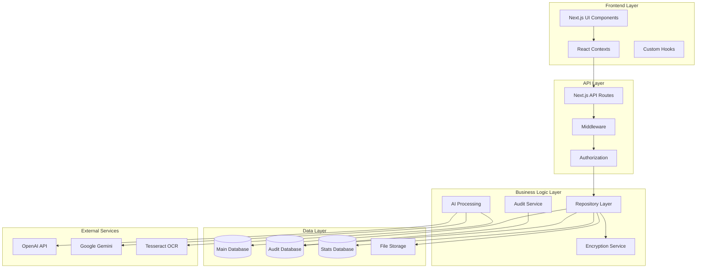
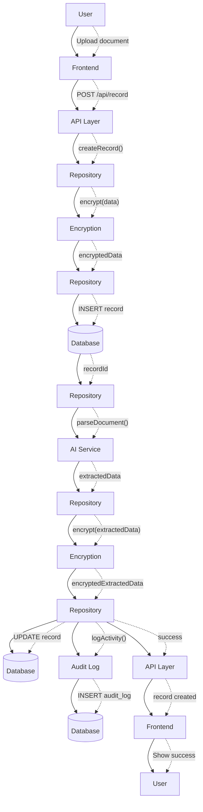
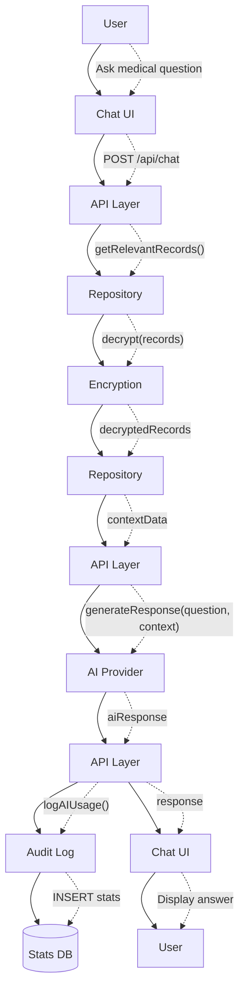
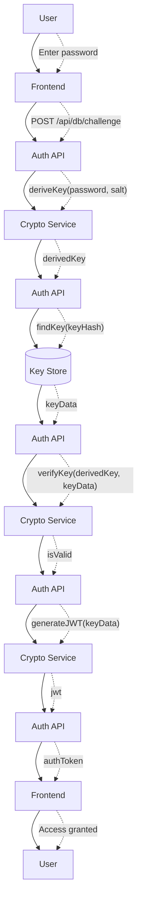

# Core Architecture

## System Purpose

Doctor Dok is a **privacy-first medical record management system** that enables users to securely store, organize, and analyze their health documents using AI-powered features. The system provides:

- **Encrypted local storage** of medical records and attachments
- **AI-powered document analysis** for extracting structured health data
- **Intelligent chat interface** for querying medical history
- **Audit logging** for security and compliance
- **Multi-tenant architecture** with user-isolated data

## Guiding Principles

### 1. Privacy by Design
- **End-to-end encryption** for all sensitive data
- **Local-first storage** with user-controlled encryption keys
- **Zero-knowledge architecture** - server cannot decrypt user data
- **Minimal data collection** with explicit user consent

### 2. Security First
- **Multi-layered security** with encryption at rest and in transit
- **Comprehensive audit logging** for all data access
- **Key-based authentication** with ACL support
- **Database isolation** per user/tenant

### 3. AI-Enhanced Experience
- **Intelligent document parsing** using multiple AI providers
- **Natural language querying** of medical records
- **Automated data extraction** from PDFs and images
- **Smart categorization** and tagging

### 4. Scalable Architecture
- **Modular component design** with clear separation of concerns
- **Database partitioning** for performance optimization
- **Connection pooling** for efficient resource usage
- **Horizontal scaling** support through multi-database architecture

## High-Level Component Map

## Core Components

### Frontend Architecture

**Technology Stack:**
- **Next.js 14** - React framework with App Router
- **TypeScript** - Type-safe development
- **Tailwind CSS** - Utility-first styling
- **shadcn/ui** - Component library
- **React Contexts** - State management

**Key Components:**
- `RecordContext` - Medical record management
- `ChatContext` - AI chat functionality  
- `DatabaseContext` - Database connection management
- `ConfigContext` - Application configuration
- `AuditContext` - Security audit logging

### API Layer

**Next.js API Routes:**
- `/api/record` - Medical record CRUD operations
- `/api/folder` - Folder management
- `/api/encrypted-attachment` - File upload/download
- `/api/db` - Database management (create, authorize, challenge)
- `/api/audit` - Audit log access
- `/api/stats` - Usage statistics
- `/api/config` - Configuration management

**Authentication & Authorization:**
- JWT-based session management
- Key-based database access control
- Middleware for request validation
- ACL enforcement per operation

### Business Logic Layer

**Repository Pattern:**
- `ServerRecordRepository` - Medical record operations
- `ServerKeyRepository` - Encryption key management
- `ServerAuditRepository` - Audit logging
- `ServerConfigRepository` - Configuration storage
- `ServerStatRepository` - Statistics tracking

**Core Services:**
- **Encryption Service** - AES-256 encryption with Argon2 key derivation
- **AI Processing** - Multi-provider document analysis
- **Audit Service** - Comprehensive activity logging
- **File Storage** - Secure attachment management

### Data Layer

**Multi-Database Architecture:**
1. **Main Database** - Core application data
2. **Audit Database** - Security and compliance logs
3. **Stats Database** - Usage analytics and metrics

**Database Provider:**
- Connection pooling (max 50 connections)
- Automatic migration management
- Database partitioning support
- SQLite with WAL mode for concurrency

## Data Flow

### Record Creation Flow

### Chat Query Flow

## Security Architecture

### Encryption Model

**Data Encryption:**
- **AES-256-GCM** for data encryption
- **Argon2** for key derivation
- **PBKDF2** for password hashing
- **Random IV/Salt** generation per operation

**Key Management:**
- User-provided master password
- Derived encryption keys per database
- Key rotation and expiry support
- ACL-based access control

### Authentication Flow

## Performance Characteristics

### Database Optimization

**Connection Management:**
- Connection pooling (50 max connections)
- Lazy connection initialization
- Automatic connection cleanup
- Database-specific pools

**Query Optimization:**
- Indexed foreign keys and timestamps
- SQLite WAL mode for concurrency
- Prepared statements for security
- Batch operations for bulk data

### Caching Strategy

**Frontend Caching:**
- React Query for API response caching
- Browser storage for user preferences
- Service Worker for offline support

**Backend Caching:**
- Database connection pooling
- Prepared statement caching
- File system caching for attachments

## Scalability Considerations

### Horizontal Scaling

**Database Partitioning:**
- Monthly audit log partitions
- User-isolated database instances
- Configurable partition strategies

**Service Isolation:**
- Separate databases for different data types
- Independent scaling of AI processing
- Microservice-ready architecture

### Vertical Scaling

**Resource Optimization:**
- Efficient memory usage with connection pooling
- Lazy loading of large datasets
- Streaming for file operations
- Background processing for AI tasks

## Development Guidelines

### Code Organization

**Directory Structure:**
- `src/app/` - Next.js App Router pages and API routes
- `src/components/` - Reusable UI components
- `src/contexts/` - React context providers
- `src/data/` - Data access layer (client/server)
- `src/lib/` - Utility functions and helpers
- `src/ocr/` - AI processing providers

**Naming Conventions:**
- PascalCase for components and classes
- camelCase for functions and variables
- kebab-case for file names
- UPPER_CASE for constants

### Security Best Practices

**Data Handling:**
- Always encrypt sensitive data before storage
- Use prepared statements for database queries
- Validate all user inputs
- Log security-relevant events

**Error Handling:**
- Never expose internal errors to users
- Log detailed errors for debugging
- Use appropriate HTTP status codes
- Implement graceful degradation

## Monitoring & Observability

### Audit Logging

**Logged Events:**
- User authentication attempts
- Data access and modifications
- AI API usage and costs
- System errors and exceptions

**Audit Data:**
- Timestamp and user identification
- Operation type and parameters
- Before/after data states
- IP address and user agent

### Performance Monitoring

**Metrics Collection:**
- API response times
- Database query performance
- AI processing duration
- Memory and CPU usage

**Usage Analytics:**
- Feature usage patterns
- AI token consumption
- User engagement metrics
- Error rates and types 