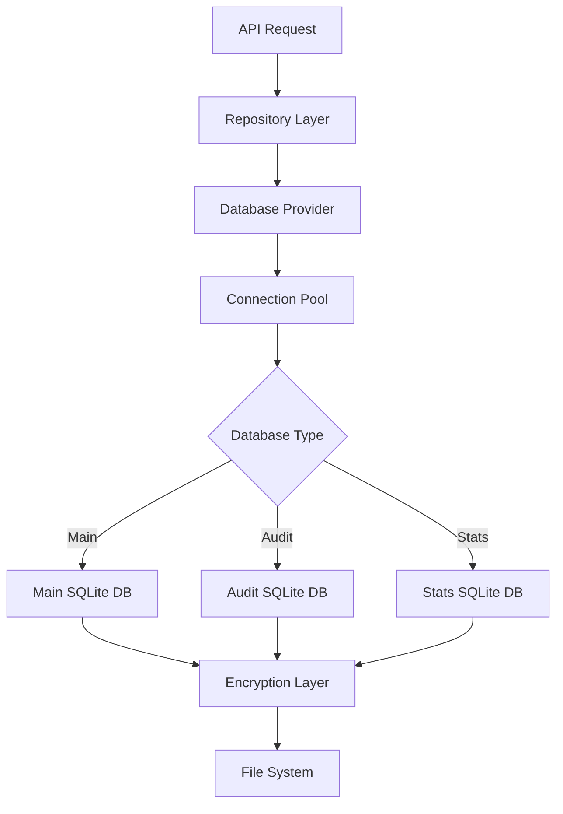

# Database Domain

## Scope

The Database domain manages all data persistence, storage, and retrieval operations for the Doctor Dok application. It provides encrypted, secure storage for medical records, attachments, audit logs, and usage statistics across multiple SQLite databases with automatic partitioning and migration support.

## Components

### Core Database Architecture

The system uses **three separate SQLite databases** for data segregation and performance optimization:

1. **Main Database** (`db.sqlite`)
   - Medical records and folders
   - Encrypted attachments metadata
   - User configuration
   - Encryption keys and access control
   - Terms acceptance records

2. **Audit Database** (`db-audit.sqlite`) 
   - Security audit logs
   - User activity tracking
   - Data change history
   - Access control violations

3. **Stats Database** (`db-stats.sqlite`)
   - AI API usage statistics
   - Token consumption tracking
   - Performance metrics
   - Usage analytics

### Database Schemas

#### Main Database Schema (`db-schema.ts`)

**Tables:**
- `folders` - Organizational containers for records
- `records` - Core medical record data with encrypted content
- `encryptedAttachments` - File metadata and storage references
- `keys` - Encryption key management and access control
- `config` - Application configuration storage
- `terms` - Terms of service acceptance tracking

**Key Fields:**
```sql
-- Records table (core entity)
records {
  id: PRIMARY KEY AUTOINCREMENT
  folderId: FOREIGN KEY → folders.id
  title, description, type, tags: TEXT
  json: JSON (structured medical data)
  text: TEXT (extracted/transcribed content)
  transcription: TEXT (audio transcriptions)
  checksum: TEXT (data integrity)
  eventDate: TEXT (medical event date)
  createdAt, updatedAt: TIMESTAMP
}

-- Encryption Keys table
keys {
  keyLocatorHash: PRIMARY KEY
  databaseIdHash: TEXT (database identifier)
  keyHash: TEXT (hashed encryption key)
  encryptedMasterKey: TEXT (encrypted master key)
  acl: TEXT (access control list)
  expiryDate: TIMESTAMP
}
```

#### Audit Database Schema (`db-schema-audit.ts`)

**Tables:**
- `audit` - Security and activity audit logs

**Key Fields:**
```sql
audit {
  id: PRIMARY KEY AUTOINCREMENT
  ip, ua: TEXT (client identification)
  keyLocatorHash: TEXT (key reference)
  databaseIdHash: TEXT (database reference)
  recordLocator: TEXT (record reference)
  encryptedDiff: TEXT (encrypted change data)
  eventName: TEXT (action type)
  createdAt: TIMESTAMP
}
```

#### Stats Database Schema (`db-schema-stats.ts`)

**Tables:**
- `stats` - AI API usage and performance metrics

**Key Fields:**
```sql
stats {
  id: PRIMARY KEY AUTOINCREMENT
  eventName: TEXT (operation type)
  promptTokens, completionTokens: INTEGER
  finishReasons: TEXT
  createdMonth, createdDay, createdYear, createdHour: INTEGER
  counter: INTEGER
  createdAt: TIMESTAMP
}
```

### Database Provider (`db-provider.ts`)

**Connection Pool Management:**
- Maintains up to 50 concurrent database connections
- Automatic connection lifecycle management
- Database partitioning support for scaling
- Lazy loading and connection reuse

**Database Creation & Migration:**
- Automatic database initialization
- Schema migration management via Drizzle ORM
- Database manifest creation with metadata
- Directory structure management

## Dependencies

### External Dependencies
- **Drizzle ORM** - Type-safe database operations and migrations
- **better-sqlite3** - High-performance SQLite driver
- **Node.js fs/path** - File system operations

### Internal Dependencies
- **Crypto Module** (`src/lib/crypto.ts`) - Encryption/decryption operations
- **Utils Module** (`src/lib/utils.ts`) - Timestamp and utility functions
- **Repository Layer** - Data access abstraction

### Configuration Dependencies
- **Drizzle Configs:**
  - `drizzle.config.ts` - Main database configuration
  - `drizzle.audit.config.ts` - Audit database configuration  
  - `drizzle.stats.config.ts` - Stats database configuration

## Processes

### Database Initialization Process

1. **Database Creation**
   ```typescript
   // Check if database exists
   maintenance.checkIfDatabaseExists(databaseId)
   
   // Create directory structure
   fs.mkdirSync(databaseDirectory, { recursive: true })
   
   // Initialize database file
   const db = new Database(databaseFile)
   
   // Run migrations
   migrate(drizzleInstance, { migrationsFolder: 'drizzle' })
   ```

2. **Connection Pool Management**
   ```typescript
   // Pool key format: {databaseId}-{schema}-{partition}
   const poolKey = `${databaseId}-${databaseSchema}${databasePartition ? '-' + databasePartition : ''}`
   
   // Automatic cleanup when pool limit reached
   if (Object.keys(databaseInstances).length >= maxPool) {
     delete databaseInstances[Object.keys(databaseInstances)[0]]
   }
   ```

### Data Partitioning Strategy

**Audit Partitioning:**
- Monthly partitions in `audit-partitions/` directory
- Format: `db-audit-{YYYY-MM}.sqlite`
- Automatic partition creation based on date

**Benefits:**
- Improved query performance
- Easier data archival
- Reduced database file sizes
- Better concurrent access

### Migration Management

**Migration Files Location:**
- Main: `drizzle/` directory
- Audit: `drizzle-audit/` directory  
- Stats: `drizzle-stats/` directory

**Migration Process:**
1. Schema changes trigger new migration files
2. Automatic migration execution on database connection
3. Migration metadata stored in `meta/` subdirectories
4. Rollback support via Drizzle ORM

### Security & Encryption

**Encryption at Rest:**
- All sensitive data encrypted before database storage
- Encryption keys stored separately with access control
- Key rotation and expiry support

**Access Control:**
- Key-based authentication system
- ACL (Access Control List) per encryption key
- Database-level isolation per user/tenant

## Interfaces

### Database Provider Interface

```typescript
// Main pool function
pool(databaseId: string, databaseSchema?: string, databasePartition?: string, createNewDb?: boolean): Promise<BetterSQLite3Database>

// Maintenance operations
maintenance.databaseDirectory(databaseId: string, databaseSchema?: string, databasePartition?: string): string
maintenance.databaseFileName(databaseId: string, databaseSchema?: string, databasePartition?: string): string
maintenance.createDatabaseManifest(databaseId: string, manifest: DatabaseManifest): Promise<void>
maintenance.checkIfDatabaseExists(databaseId: string): boolean
```

### Repository Layer Interface

**Base Repository Pattern:**
- Generic CRUD operations
- Encryption/decryption handling
- Audit logging integration
- Error handling and validation

**Specialized Repositories:**
- `ServerRecordRepository` - Medical records operations
- `ServerAuditRepository` - Audit log operations  
- `ServerKeyRepository` - Encryption key management
- `ServerConfigRepository` - Configuration management
- `ServerStatRepository` - Statistics tracking

### Database Configuration

**Environment-based Configuration:**
- Development: Local SQLite files in `data/` directory
- Production: Configurable database location
- Testing: In-memory or temporary databases

**Connection String Format:**
```
data/{databaseIdHash}/db.sqlite                    // Main database
data/{databaseIdHash}/db-audit.sqlite              // Audit database  
data/{databaseIdHash}/db-stats.sqlite              // Stats database
data/{databaseIdHash}/audit-partitions/db-audit-{YYYY-MM}.sqlite  // Partitioned audit
```

## Performance Characteristics

**Optimization Features:**
- Connection pooling (max 50 connections)
- Lazy database initialization
- Automatic connection cleanup
- SQLite WAL mode for better concurrency
- Indexed foreign keys and timestamps

**Scalability Considerations:**
- Database partitioning for large datasets
- Separate databases for different data types
- Configurable pool sizes
- Automatic migration management

## Data Flow



## Security Model

**Multi-layered Security:**
1. **Application-level encryption** before database storage
2. **Key-based access control** per database instance
3. **Audit logging** for all data access
4. **Database isolation** per tenant/user
5. **File system permissions** on SQLite files

**Key Management:**
- Master keys encrypted with user-provided passwords
- Key derivation using Argon2 hashing
- Key rotation and expiry mechanisms
- ACL-based permission system 